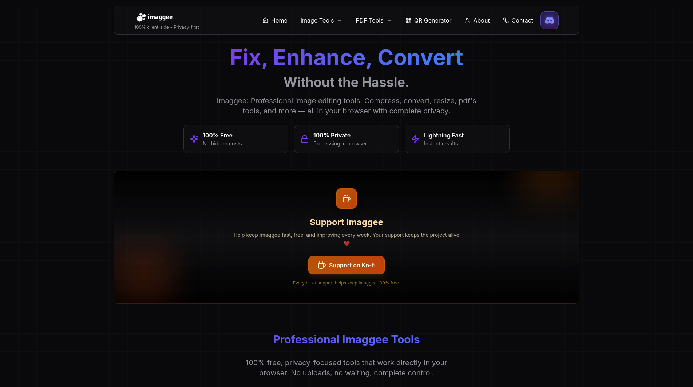

# Imaggee


[](https://opensource.org/licenses/MIT)
[](https://ko-fi.com/imaggee) [](http://makeapullrequest.com)


**Fix, Enhance, Convert — Without the Hassle**

Imaggee is a professional, open-source suite of image editing tools that runs entirely in your browser. It prioritizes privacy, speed, and ease of use, offering a wide range of features from compression to PDF manipulation without ever uploading your files to a server.

## 🚀 Features

### 100% Client-Side & Private
All processing happens directly in your browser. **No uploads, no cloud storage, no tracking.** Your data stays yours.

### Comprehensive Toolset

#### 🛠️ Image Tools

| Tool | Description | Key Highlights |
|------|------------|----------------|
| **Compress** | Reduce image file size up to 80% | Smaller, Quality, Click to use |
| **Convert** | Convert between PNG, JPG, WebP, GIF, BMP, and more | 10+ Formats, Instant, Click to use |
| **Resize** | Resize images to exact dimensions | Precision, Batch, Click to use |
| **Combine** | Merge multiple images into collages or creative compositions | Layouts, Smart, Click to use |
| **Blur & Emoji** | Add artistic blur effects and expressive emojis | Privacy, Fun, Click to use |
| **Color Palette** | Extract color palettes from your images for design | Smart, Export, Click to use |
| **Metadata** | View, edit, and manage image metadata (EXIF, IPTC) | Privacy, Edit, Click to use |

---

#### 📄 PDF Tools

| Tool | Description | Key Highlights |
|------|------------|----------------|
| **Merge PDF** | Combine multiple PDF files into one document | Merge, Fast, Click to use |
| **Split PDF** | Extract pages or sections from PDFs quickly | Split, Batch, Click to use |
| **Images to PDF** | Convert images into a single PDF effortlessly | Multi Formats, Fast, Click to use |
| **PDF to Image** | Convert PDF pages into high-quality images | High Quality, Instant, Click to use |

---


#### 🔳 QR Tools

| Tool | Description | Key Highlights |
|------|------------|----------------|
| **QR Generator** | Create custom QR codes for URLs, text, contacts, and more | Custom, Export, Click to use |

---

## 🛠️ Tech Stack

Built with modern web technologies for performance and developer experience:

- **Framework**: [React](https://reactjs.org/) + [Vite](https://vitejs.dev/)
- **Language**: [TypeScript](https://www.typescriptlang.org/)
- **Styling**: [Tailwind CSS](https://tailwindcss.com/)
- **Image/PDF Processing**

## 📦 Installation & Running Locally

Follow these steps to get a local copy up and running.

### Prerequisites
- Node.js (v18 or higher)
- npm or yarn or bun

### Steps

1. **Clone the repository**
   ```bash
   git clone https://github.com/elalaoui1/imaggee.git
   cd imaggee
   ```

2. **Install dependencies**
   ```bash
   npm install
   # or
   bun install
   ```

3. **Start the development server**
   ```bash
   npm run dev
   # or
   bun dev
   ```

4. **Open in browser**
   Visit `http://localhost:8080` (or the port shown in your terminal).

## 🤝 Contribution Guide

We welcome contributions! Please see our [CONTRIBUTING.md](CONTRIBUTING.md) for details on how to get started.

1. Fork the Project
2. Create your Feature Branch (`git checkout -b feature/AmazingFeature`)
3. Commit your Changes (`git commit -m 'Add some AmazingFeature'`)
4. Push to the Branch (`git push origin feature/AmazingFeature`)
5. Open a Pull Request

Please also read our [Code of Conduct](CODE_OF_CONDUCT.md).

## 📸 Screenshots

 

## 🌐 Live Demo

Check out the live version here: [imaggee.com](https://imaggee.com)

## ✍️ Author

**Imaggee**

- Website: [imaggee.com](https://imaggee.com)
- GitHub: [@elalaoui1](https://github.com/elalaoui1)

---

## ❤️ Support Imaggee

Help keep Imaggee fast, free, and improving every week. Your support keeps the project alive.

[Support on Ko-fi](https://ko-fi.com/imaggee)  

---
## 📄 License

Distributed under the MIT License. See `LICENSE` for more information.
